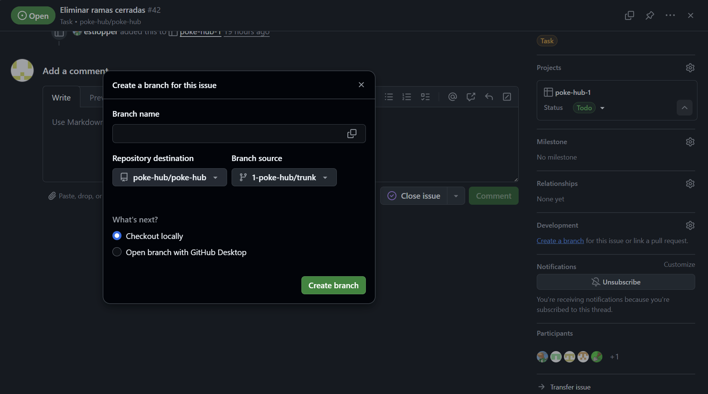

El documento del proyecto debe ser un documento que sintetice los aspectos del proyecto elegido para su desarrollo con respecto a los temas vistos en clases. 

Debe tener claramente identificados los nombres y apellidos de cada componente, grupo al que pertenecen (1, 2, o 3 mañana o tarde), curso académico, nombre del proyecto (seguir la política de nombres). Use este [[modelo de portada]] para el documento del proyecto y alójelo en su repositorio o en otro sitio accesible y que tenga posibilidad de verse el último momento de edicación. Puede usar el repositorio del proyecto usando para ello el lenguaje de [markdown](https://guides.github.com/features/mastering-markdown/) que ofrece github. En todo caso, debe ser un documento elaborado en formato [wiki]. 

Será un documento presentado de manera profesional guardando la forma en los estilos y contenidos y con el máximo nivel de rigor académico y profesional.

Tenga en cuenta los siguientes aspectos: 

* Siempre diferencie claramente las secciones y subsecciones y para ello use etiquetas de encabezado como las que se disponen en los lenguajes tipo _markdown_

# Apartados del documento 
1. [Indicadores del proyecto](#indicadores-del-proyecto)
2. [Integración con otros equipos](#integración-con-otros-equipos)
3. [Resumen ejecutivo](#resumen-ejecutivo-800-palabras-aproximadamente)
4. [Descripción del sistema](#descripción-del-sistema-1500-palabras-aproximadamente)
   - 4.1. [Módulo de Búsqueda Avanzada con ElasticSearch](#módulo-de-búsqueda-avanzada-con-elasticsearch)
   - 4.2. [Gestión y Personalización de Datasets: El "Carrito de Modelos"](#gestión-y-personalización-de-datasets-el-carrito-de-modelos)
   - 4.3. [Componentes Sociales y de Usuario](#componentes-sociales-y-de-usuario)
   - 4.4. [Seguridad y Autenticación Reforzada](#seguridad-y-autenticación-reforzada)
   - 4.5. [Entorno de Pruebas y Simulación: Fakenodo](#entorno-de-pruebas-y-simulación-fakenodo)
   - 4.6. [Cambios Explícitos Desarrollados](#cambios-explícitos-desarrollados)
5. [Visión global del proceso de desarrollo](#visión-global-del-proceso-de-desarrollo-1500-palabras-aproximadamente)
   - 5.1. [Planificación y Gestión de Tareas](#1-planificación-y-gestión-de-tareas)
   - 5.2. [Estrategia de Ramificación: EGC Flow](#2-estrategia-de-ramificación-egc-flow)
   - 5.3. [Ciclo de Vida de una Funcionalidad](#3-ciclo-de-vida-de-una-funcionalidad)
     - 5.3.1. [Desarrollo en la Rama de Característica](#31-desarrollo-en-la-rama-de-característica-n-poke-hubfeatdescripcion-corta)
     - 5.3.2. [Integración Continua (CI)](#32-integración-continua-ci)
     - 5.3.3. [Revisión de Código por Pares](#33-revisión-de-código-por-pares-code-review)
   - 5.4. [Integración Global y Despliegue a Producción](#4-integración-global-y-despliegue-a-producción)
     - 5.4.1. [Sincronización Coordinada hacia `main`](#41-sincronización-coordinada-hacia-main)
     - 5.4.2. [Despliegue Continuo (CD)](#42-despliegue-continuo-cd)
   - 5.5. [Caso Práctico: Flujo Completo de un Cambio](#5-caso-práctico-flujo-completo-de-un-cambio)
6. [Entorno de desarrollo](#entorno-de-desarrollo-800-palabras-aproximadamente)
   - 6.1. [Componentes y Versiones](#componentes-y-versiones)
   - 6.2. [Pasos para la Configuración del Entorno Local](#pasos-para-la-configuración-del-entorno-local)
   - 6.3. [Consideraciones Adicionales](#consideraciones-adicionales)
7. [Ejercicio de propuesta de cambio](#ejercicio-de-propuesta-de-cambio)
8. [Conclusiones y trabajo futuro](#conclusiones-y-trabajo-futuro)

## Indicadores del proyecto

(_debe dejar enlaces a evidencias que permitan de una forma sencilla analizar estos indicadores, con gráficas y/o con enlaces_)

Miembro del equipo  | Horas | Commits | LoC | Test | Issues | Work Item| Dificultad
------------- | ------------- | ------------- | ------------- | ------------- | ------------- |  ------------- |  ------------- | 
[Borja León, Joaquín](https://github.com/JoaquinBorjaLeon) | HH | XX | YY | ZZ | II | Descripción breve | H/M/L |
[Diáz Vázquez, Adrián](https://github.com/adrdiavaz) | HH | XX | YY | ZZ | II | Descripción breve | H/M/L |
[Escobar Capilla, Ariel](https://github.com/ArielEC) | HH | XX | YY | ZZ | II | Descripción breve | H/M/L |
[López Pérez, Esteban](https://github.com/estlopper) | HH | XX | YY | ZZ | II | Descripción breve | H/M/L |
[Pons Moris, Jesús](https://github.com/Jesus-Pons) | HH | XX | YY | ZZ | II | Descripción breve | H/M/L |
[Rodríguez Durán, Jose Ángel](https://github.com/DLJ7666) | HH | XX | YY | ZZ | II | Descripción breve | H/M/L |
**TOTAL** | tHH  | tXX | tYY | tZZ | tII | Descripción breve | H (X)/M(Y)/L(Z) |

La tabla contiene la información de cada miembro del proyecto y el total de la siguiente forma: 
  * Horas: número de horas empleadas en el proyecto
  * Commits: solo contar los commits hechos por miembros del equipo, no lo commits previos
  * LoC (líneas de código): solo contar las líneas producidas por el equipo y no las que ya existían o las que se producen al incluir código de terceros
  * Test: solo contar los test realizados por el equipo nuevos
  * Issues: solo contar las issues gestionadas dentro del proyecto y que hayan sido gestionadas por el equipo
  * Work Item: principal WI del que se ha hecho cargo el miembro del proyecto
  * Dificultad: señalar el grado de dificultad en cada caso. Además, en los totales, poner cuántos se han hecho de cada grado de dificultad entre paréntesis. 

## Integración con otros equipos
Equipos con los que se ha integrado y los motivos por lo que lo ha hecho y lugar en el que se ha dado la integración: 
* [poke-hub-2](https://github.com/poke-hub): La colaboración entre ambos equipos ha potenciado el desarrollo de Poke-hub mucho más que el trabajo individual. Aunque ambos pertenecen a la misma organización, comparten un único repositorio de forma eficiente. Esto es posible gracias a una estrategia de ramificación que utiliza una rama main central y dos ramas de integración (trunks) independientes, una asignada a cada equipo.

## Resumen ejecutivo (800 palabras aproximadamente)
PokeHub es una plataforma web desarrollada por DiversoLab y el equipo de PokeHub que funciona como un repositorio de modelos de Pokémon en un formato especializado ("Poke format"). El proyecto sigue los principios de Open Science, promoviendo la accesibilidad y reutilización de los datos. Para ello, se integra con Fakenodo, un sistema de depósito de datos, y con flamapy para el procesamiento de los modelos.

El sistema se ha construido sobre una arquitectura moderna basada en Python, utilizando el microframework Flask para el backend y una base de datos MariaDB para la persistencia de datos. Un aspecto clave del desarrollo ha sido el establecimiento de un proceso robusto de Integración Continua (CI) mediante GitHub Actions. El entorno de CI simula el entorno de producción, incluyendo servicios como la base de datos, lo que permite detectar errores de forma temprana.

El proceso de desarrollo se ha gestionado siguiendo prácticas de la industria, como el uso de ramas de Git para el desarrollo de nuevas funcionalidades, sentando las bases para futuras implementaciones de Despliegue Continuo (CD).

## Descripción del sistema (1.500 palabras aproximadamente)
PokeHub ha evolucionado desde un repositorio de datasets monolíticos a una plataforma dinámica y granular, centrada en la reutilización y composición de modelos individuales. La arquitectura actual está diseñada para potenciar la flexibilidad, la capacidad de descubrimiento y la seguridad, transformando la manera en que los usuarios interactúan, consumen y contribuyen con los datos.

A continuación, se detallan los componentes clave y las modificaciones arquitectónicas que sustentan esta nueva visión del sistema.

### Módulo de Búsqueda Avanzada con ElasticSearch

Para abordar la necesidad de un descubrimiento de recursos rápido y preciso, se ha integrado un motor de búsqueda basado en **ElasticSearch**. Esta decisión arquitectónica reemplaza las búsquedas tradicionales sobre la base de datos relacional, ofreciendo un rendimiento superior y capacidades de consulta complejas.

El sistema implementa una **indexación exhaustiva** que abarca múltiples facetas de los datasets:
*   **Metadatos principales:** Título, descripción, autor y tags.
*   **Contenido granular:** Nombres de los modelos individuales dentro de cada dataset.
*   **Contenido de ficheros:** Se indexa el texto dentro de los ficheros de los modelos, permitiendo búsquedas por contenido específico.

Una característica fundamental es la **sincronización en tiempo real**. Mediante el uso de *event listeners* acoplados a las operaciones de creación y actualización (CRUD) de la base de datos, cualquier modificación en un dataset —ya sea la edición de sus metadatos o la subida de una nueva versión— dispara automáticamente una reindexación en ElasticSearch. Esto garantiza que los resultados de búsqueda reflejen siempre el estado más actual del repositorio, sin retardos ni inconsistencias.

La interfaz de usuario se beneficia directamente de esta integración, ofreciendo **filtros avanzados** que permiten a los usuarios acotar sus búsquedas por fecha de publicación, autor o comunidad, mejorando significativamente la experiencia de descubrimiento.

### Gestión y Personalización de Datasets: El "Carrito de Modelos"

El cambio más significativo a nivel funcional es la introducción de una lógica de **selección y composición de modelos**, análoga a un "carrito de la compra". Esta funcionalidad rompe el paradigma del dataset como una unidad atómica e indivisible. Ahora, los usuarios pueden navegar por diferentes datasets y seleccionar modelos individuales de interés.

Este "carrito" actúa como un área de preparación (staging area) que habilita dos flujos de trabajo principales:

1.  **Descarga Personalizada:** Permite al usuario descargar un único paquete `.zip` que contiene exclusivamente los modelos que ha seleccionado, sin necesidad de descargar datasets completos. Esto optimiza el ancho de banda y facilita el acceso directo a los recursos de interés.
2.  **Construir mi Propio Dataset:** Esta es la funcionalidad más potente. El contenido del carrito puede ser utilizado como base para crear un **nuevo dataset derivado**. El sistema presenta al usuario un formulario de subida, pre-cargado con los modelos seleccionados, donde puede añadir nuevos metadatos (título, descripción, etc.). Al completar el proceso, se genera un nuevo dataset en la plataforma, compuesto por una amalgama de modelos de diversas fuentes, fomentando así la reutilización y la creación de conocimiento derivado.

Para soportar esta granularidad, fue necesario **adaptar el núcleo de `uvl_hub`**, modificando la estructura de datos para gestionar las relaciones entre los modelos individuales y sus datasets de origen y derivados.

### Componentes Sociales y de Usuario

Para fomentar la comunidad y dar visibilidad a los contribuidores, se han implementado perfiles de usuario públicos. Al visitar el perfil de un usuario, es posible visualizar un **listado completo de todos los datasets que ha subido**, centralizando su contribución y facilitando el seguimiento de autores específicos.

Además, cada página de dataset ahora incluye un **contador de descargas público**. Este contador se incrementa automáticamente cada vez que un usuario descarga el paquete completo, sirviendo como un indicador de popularidad e impacto del recurso dentro de la comunidad.

### Seguridad y Autenticación Reforzada

La seguridad de las cuentas de usuario se ha robustecido mediante la implementación de la **autenticación de doble factor (2FA)**. Los usuarios pueden ahora vincular su cuenta con una aplicación de autenticación (como Google Authenticator o similar) para añadir una capa extra de protección. Este mecanismo es crucial para proteger la integridad de los datos, especialmente para aquellos usuarios con permisos para subir y gestionar datasets.

### Entorno de Pruebas y Simulación: Fakenodo

El desarrollo y la integración continua se han optimizado gracias a la creación de un servicio **"Fakenodo"**. Se trata de una API RESTful interna que simula el comportamiento y las respuestas del repositorio externo Zenodo, con el cual Pokehub se integra.

Este servicio mock permite:
*   **Desarrollo offline:** Los desarrolladores pueden trabajar en funcionalidades de integración sin depender de una conexión a internet o del estado del servicio real de Zenodo.
*   **Pruebas de integración automatizadas:** En el pipeline de CI/CD, las pruebas que interactúan con el repositorio de datos se ejecutan contra el mock. Esto garantiza que los tests sean rápidos, determinísticos y no fallen por problemas en servicios de terceros, aislando el comportamiento de nuestra aplicación.

### Cambios Explícitos Desarrollados

*   **Integración de ElasticSearch:** Implementación del motor de búsqueda y lógica de indexación/sincronización.
*   **Sistema de "Carrito":** Desarrollo de la lógica para seleccionar, agrupar y gestionar modelos individuales.
*   **Construir mi propio Dataset:** Creación del flujo para generar nuevos datasets a partir del carrito.
*   **Descargar mi propio Dataset":** Implementación de la descarga de modelos seleccionados en un zip.
*   **Ver perfil de usuario:** Vista de perfil con listado de datasets del usuario.
*   **Contador de Descargas:** Mecanismo de conteo y visualización en la página del dataset.
*   **Autenticación de Doble Factor (2FA):** Implementación del flujo de configuración y verificación de 2FA.
*   **Evolucionar uvlhub en pokehub:** Modificaciones en la base de `uvl_hub` para soportar la gestión modelos poke.

## Visión global del proceso de desarrollo (1.500 palabras aproximadamente)
El ciclo de vida del desarrollo de software (SDLC) en el proyecto Poke-Hub está fundamentado en principios ágiles, con un fuerte énfasis en la calidad del código, la entrega continua de valor y la colaboración efectiva entre equipos. Dada la estructura del proyecto, dividido en sub-equipos (poke-hub-1, poke-hub-2) que trabajan sobre un repositorio común, se ha diseñado un flujo de trabajo que equilibra la autonomía de los equipos con la estabilidad de la rama principal (`main`).

Este proceso se articula mediante una gestión de tareas basada en Work Items (WI), una estrategia de ramificación jerárquica en Git y un robusto pipeline de Integración y Despliegue Continuo (CI/CD) automatizado con GitHub Actions.

### 1. Planificación y Gestión de Tareas

La unidad fundamental de trabajo es el **Work Item (WI)**, que representa una funcionalidad, un bug o una mejora específica.

*   **Gestión del Backlog:** Todo el trabajo planificado se desglosa en WIs detallados en un tablero de proyecto (como GitHub Projects). No se escribe ninguna línea de código sin un WI asociado que defina claramente los requisitos y los criterios de aceptación.
*   **Asignación de Tareas:** Al inicio de cada ciclo, el líder de cada equipo (en el caso de poke-hub-1, Jesús) es responsable de la planificación. Evalúa el backlog, prioriza las tareas y las asigna a los miembros del equipo según su perfil y carga de trabajo. Esta asignación centralizada previene la duplicidad de esfuerzos y optimiza la distribución del trabajo.

### 2. Estrategia de Ramificación: EGC Flow

Para facilitar el desarrollo en paralelo y una integración controlada, hemos adoptado una estrategia de ramificación basada en *Feature Branching* con ramas de integración por equipo.

La jerarquía de ramas es la siguiente:

*   **`main`**: Es la rama principal. Contiene el código integrado de todos los equipos, siempre en un estado estable y desplegable.
*   **`<N>-poke-hub/trunk`** (e.g., `1-poke-hub/trunk`, `2-poke-hub/trunk`): Son las ramas de desarrollo para cada equipo. `1-poke-hub/trunk` consolida todas las funcionalidades completadas y validadas del equipo poke-hub-1. Esta rama debe mantenerse siempre estable, ya que representa la versión más actualizada del trabajo del equipo.
*   **`<N>-poke-hub/feat/<descripcion-corta>`**: Son las ramas de característica (feature branches). Cada desarrollador crea una de estas ramas a partir de la rama `trunk` de su equipo para trabajar en un WI específico. Por ejemplo: `1-poke-hub/feat/download-counter`. Este aislamiento garantiza que el trabajo en curso no desestabilice la rama de integración del equipo.

### 3. Ciclo de Vida de una Funcionalidad

Desde la asignación de un WI hasta su integración, cada cambio sigue un estricto proceso de validación.

#### 3.1. Desarrollo en la Rama de Característica (`<N>-poke-hub/feat/<descripcion-corta>`)

Una vez que un desarrollador tiene un WI asignado, el primer paso es crear una rama de característica desde la última versión de la rama `trunk` de su equipo. En esta rama aislada, el desarrollador implementa la funcionalidad requerida, escribe el código fuente y desarrolla las pruebas unitarias y de integración necesarias para validar su cambio.

#### 3.2. Integración continua (CI)

Cuando el desarrollo de la característica está completo y probado localmente, el desarrollador sube su rama (`git push`) al repositorio remoto y abre una **Pull Request (PR)** para fusionar su rama `feat/` en la rama `trunk` de su equipo (e.g., `1-poke-hub/feat/download-counter` -> `1-poke-hub/trunk`).

La creación de esta PR dispara automáticamente el **pipeline de Integración Continua (CI)**, configurado en GitHub Actions. Este pipeline es el primer guardián de la calidad y ejecuta las siguientes tareas:

1.  **Análisis de Código (Linting):** Se verifica que el código cumpla con los estándares de estilo y calidad definidos para el proyecto.
2.  **Pruebas Automatizadas (Testing):** Se ejecutan todas las pruebas unitarias y de integración para asegurar que el nuevo cambio no introduce regresiones y funciona como se espera.
3.  **Construcción (Build):** Se comprueba que la aplicación se construye correctamente, validando que no hay errores de sintaxis o dependencias rotas.

Un pipeline exitoso (un "build verde") es un requisito indispensable para continuar con el proceso. Si alguna de estas etapas falla, el desarrollador debe corregir los problemas en su rama y volver a subir los cambios, lo que reiniciará el pipeline.

#### 3.3. Revisión de Código por Pares (Code Review)

Con el pipeline de CI en verde, se puede realizar el merge a la rama trunk correspondiente. Este proceso es fundamental para:

*   **Garantizar la calidad y mantenibilidad** del código.
*   **Compartir conocimiento** entre los miembros del equipo.
*   **Asegurar la coherencia** con la arquitectura y las convenciones del proyecto.

Una vez que se obtiene un CI exitoso, el desarrollador puede proceder a fusionar (*merge*) sus cambios en la rama `trunk` del equipo.

### 4. Integración Global y Despliegue a Producción

La integración del trabajo de los diferentes equipos en la rama `main` es un punto crítico que se gestiona de forma controlada.

#### 4.1. Sincronización Coordinada hacia `main`

La fusión desde las ramas `trunk` hacia `main` no es un proceso continuo ni automático. Se realiza de manera periódica (por ejemplo, al final de un sprint) y es coordinada por los líderes de los equipos.

1.  **Reunión de Sincronización:** Los líderes de poke-hub-1 (Jesús) y poke-hub-2 (Héctor) se reúnen para planificar la integración.
2.  **Análisis de Cambios:** Revisan los cambios acumulados en sus respectivas ramas `trunk` para identificar posibles conflictos funcionales o técnicos.
3.  **Fusión Controlada:** Los líderes resuelven conjuntamente cualquier conflicto de fusión que surja. Este paso humano es crucial para garantizar que la combinación de los subsistemas no rompa la aplicación global.

#### 4.2. Despliegue Continuo (CD)

Una vez que los cambios han sido validados e integrados en la rama `main`, se activa el **pipeline de Despliegue Continuo (CD)**. Este proceso automatizado se encarga de:

1.  Empaquetar la versión final de la aplicación.
2.  Ejecutar un último conjunto de pruebas de extremo a extremo (E2E) en un entorno similar a producción (staging).
3.  Si todas las pruebas pasan, desplegar la nueva versión en el entorno de producción, haciendo que los cambios estén disponibles para los usuarios finales.

### 5. Caso Práctico: Flujo Completo de un Cambio

Para ilustrar el proceso, sigamos el ciclo de vida de una nueva funcionalidad: "Añadir contador de descargas de un dataset".

1.  **Fase de Planificación:** Jesús, líder del equipo 1, asigna el WI correspondiente al desarrollador "Dev A".

2.  **Fase de Desarrollo:** "Dev A" actualiza su repositorio y crea la rama `1-poke-hub/feat/download-counter`. Implementa el filtro y sus pruebas unitarias. Al terminar, realiza el push con los cambios realizados.

3.  **Fase de Integración de Equipo:** 
    *   **CI Automático:** GitHub Actions se activa, ejecuta linting, tests y build. El resultado es exitoso (verde).
    *   **Code Review:** Se comprueba que todo funcione durante la fusión.
    *   **Merge:** "Dev A" fusiona su WI. La funcionalidad del contador de descargas de un dataset ya forma parte de `1-poke-hub/trunk`.

4.  **Fase de Integración Global:** Cuando se realizan cambios suficientes, Jesús y Héctor coordinan la integración.
    *   Realizan una fusión de `1-poke-hub/trunk` a `main`.
    *   Revisan que no haya conflictos con el trabajo del equipo 2.
    *   Tras confirmar la compatibilidad, suben la fusión a `main`.

5.  **Fase de Despliegue:** La fusión en `main` dispara el pipeline de CD. La aplicación se empaqueta, pasa las pruebas finales y se despliega automáticamente en producción.

**Resultado:** Los usuarios finales ahora pueden ver y utilizar el nuevo "Contador de descargas" en la plataforma. Este ciclo riguroso asegura que cada cambio que llega a producción ha sido validado a nivel individual (CI), de equipo (Code Review) y de arquitectura global (Sincronización Coordinada).

### Entorno de desarrollo (800 palabras aproximadamente)
El entorno de desarrollo de Pokehub está diseñado para ser consistente, reproducible y estar estrechamente alineado con el pipeline de Integración Continua (CI). Se ha adoptado un enfoque basado en **Docker** para la gestión de servicios externos, lo que garantiza que todos los miembros del equipo trabajen con las mismas versiones y configuraciones de las dependencias clave, como la base de datos y el motor de búsqueda.

#### Componentes y Versiones

El stack tecnológico principal se define de la siguiente manera, tomando como referencia el entorno de CI para asegurar la compatibilidad:

*   **Lenguaje de Programación:** Python `3.12`
*   **Framework Backend:** Flask (versión gestionada a través de `requirements.txt`)
*   **Base de Datos:** MariaDB `12.0.2`
*   **Motor de Búsqueda:** ElasticSearch `8.x`
*   **Gestión de Dependencias:** Pip con fichero `requirements.txt`
*   **Orquestación de Servicios:** Docker y Docker Compose

#### Pasos para la Configuración del Entorno Local
A continuación, se detalla el proceso para configurar un entorno de desarrollo funcional desde cero.

1.  **Prerrequisitos:**
    *   Usar Ubuntu como sistema operativo
    *   Tener instalado Python `3.12`.
    *   Tener instalado Git. En caso contrario:
    ```bash
    sudo apt install git
    git config --global user.name "<tu nombre y apellidos entrecomillados>"
    git config --global user.email <tu email>
    ```
    *   Tener instalado Docker y Docker Compose. En caso contrario
    ```bash
    sudo apt update
    sudo apt install -y apt-transport-https ca-certificates curl software-properties-common
    curl -fsSL https://download.docker.com/linux/ubuntu/gpg | sudo gpg --dearmor -o /usr/share/keyrings/docker-archive-keyring.gpg
    echo "deb [arch=$(dpkg --print-architecture) signed-by=/usr/share/keyrings/docker-archive-keyring.gpg] https://download.docker.com/linux/ubuntu $(lsb_release -cs) stable" | sudo tee /etc/apt/sources.list.d/docker.list > /dev/null
    sudo apt update
    sudo apt install -y docker-ce
    sudo usermod -aG docker ${USER}
    mkdir -p ~/.docker/cli-plugins/
    LATEST_VERSION=$(curl -s https://api.github.com/repos/docker/compose/releases/latest | grep '"tag_name":' | sed -E 's/.*"([^"]+)".*/\1/')
    curl -SL "https://github.com/docker/compose/releases/download/${LATEST_VERSION}/docker-compose-$(uname -s)-$(uname -m)" -o ~/.docker/cli-plugins/docker-compose
    chmod +x ~/.docker/cli-plugins/docker-compose
    ```

2.  **Clonar el Repositorio:**
    ```bash
    git clone <URL-del-repositorio>
    cd poke-hub
    ```

3.  **Crear y Activar un Entorno Virtual de Python:**
    ```bash
    python3 -m venv <myenvname>
    source <myenvname>/bin/activate
    ```
4.  **Actualizar el sistema:**
    ```bash
    python3 -m venv <myenvname>
    source <myenvname>/bin/activate
    ```

5.  **Instalar MariaDB:**
    ```bash
    sudo apt install mariadb-server -y
    sudo systemctl start mariadb
    sudo mysql_secure_installation

    - Enter current password for root (enter for none): (enter)
    - Switch to unix_socket authentication [Y/n]: `y`
    - Change the root password? [Y/n]: `y`
    - New password: `uvlhubdb_root_password`
    - Re-enter new password: `uvlhubdb_root_password`
    - Remove anonymous users? [Y/n]: `y`
    - Disallow root login remotely? [Y/n]: `y` 
    - Remove test database and access to it? [Y/n]: `y`
    - Reload privilege tables now? [Y/n] : `y`

    sudo mysql -u root -p
    CREATE DATABASE uvlhubdb;
    CREATE DATABASE uvlhubdb_test;
    CREATE USER 'uvlhubdb_user'@'localhost' IDENTIFIED BY 'uvlhubdb_password';
    GRANT ALL PRIVILEGES ON uvlhubdb.* TO 'uvlhubdb_user'@'localhost';
    GRANT ALL PRIVILEGES ON uvlhubdb_test.* TO 'uvlhubdb_user'@'localhost';
    FLUSH PRIVILEGES;
    EXIT;
    ```

6.  **Configurar el entorno de la aplicación:**
    ```bash
    cp .env.local.example .env
    echo "webhook" > .moduleignore
    ```

7.  **Instalar Dependencias de Python:**
    ```bash
    pip install --upgrade pip
    pip install -r requirements.txt
    pip install -e ./
    ```

8.  **Inicializar la Base de Datos y Ejecutar la Aplicación:**
    ```bash
    # Aplicar migraciones
    flask db upgrade

    # Popular base de datos
    rosemary db:seed

    # Iniciar la aplicación
    flask run (--host=0.0.0.0 --reload --debug)
    ```

#### Consideraciones Adicionales
Si bien los componentes del backend están estandarizados, los miembros del equipo tienen libertad para utilizar su editor de código o IDE de preferencia (como Visual Studio Code o PyCharm), aunque el recomendado sería Visual Studio Code. El uso de Docker y un fichero `requirements.txt` garantiza que, independientemente del sistema operativo anfitrión o las herramientas de edición, el comportamiento de la aplicación y sus servicios sea idéntico para todos los desarrolladores, mitigando eficazmente los problemas de inconsistencia entre entornos.

### Ejercicio de propuesta de cambio
Para hacer cualquier cambio deberemos seguir los siguientes pasos:

1. El primer paso a realizar es la creación de la incidencia en el tablero de proyecto en github. Si es de una complejidad elevada se describirá en la descripción en que consiste con mayor detalle, asignar a los miembros responsables de la tarea y añadir las etiquetas pertinentes.

2. Tras esto, la persona asignada a la incidencia creará una rama siguiendo el esquema definido en el apartado [Estrategia de Ramificación: EGC Flow](#2-estrategia-de-ramificación-egc-flow). Esto se puede realizar mediante la terminal escribiendo el comando git branch o desde la propia página de GitHub.

3. El siguiente paso a realizar es el desarrollo de la implementación. Para ello se trabajará en el entorno hasta que se comprueben que los cambios realizados hayan sido satisfactorios. Una vez terminada la implementación, se hará un commit o varios y un push, para observar los cambios aplicados en el repositorio remoto.
4. Una vez subido, se ejecutará el CI definido en el apartado [Integración continua (CI)](#32-integración-continua-ci)

5. Si todo ha salido correcto se procederá a fusionar nuestra rama con la rama trunk mediante la funcion merge. Se comprueba que no hayan surgido conflictos y en el caso de que los hubiera solventamos el error. Ya podemos pasar nuestra incidencia a la columna Done.
6. Por último estos cambios se pasarán a main cuando se realice la fusión de las ramas trunks.

### Conclusiones y trabajo futuro
Utilizar UVLHub como base para el proyecto ha sido una buena oportunidad para experimentar con un entorno de desarrollo real.

Sin embargo, la curva de aprendizaje ha sido más pronunciada de lo deseable. El desconocimiento generalizado de las herramientas que se usan en el proyecto dentro del equipo supuso un freno importante. En lugar de centrarnos en las herramientas de configuración y despliegue, gran parte de nuestras horas se consumieron investigando el funcionamiento interno de la aplicación para poder realizar las modificaciones requeridas.

Creemos que la asignatura sería mucho más aprovechable si se impartiera una base técnica sobre estas herramientas al inicio, permitiendo a los alumnos centrarse en los objetivos de la materia y no en aprender algo nuevo sobre la marcha.

En conclusión, aunque la dificultad técnica fue alta, valoramos positivamente adquirir competencias que van más allá de la simple programación, como es la gestión de un equipo y de la gestión de incidencias, una habilidad esencial para cualquier desarrollador actual.

#### Mejoras para UvlHub
La aplicación actualmente tiene una gran funcionalidad, sin embargo, creemos que todavía hay aspectos que se pueden mejorar:

- El diseño de la página, que a nuestro parecer podría tener un estilo más atractivop ara el usuario.
- Traducción al español de la aplicación
